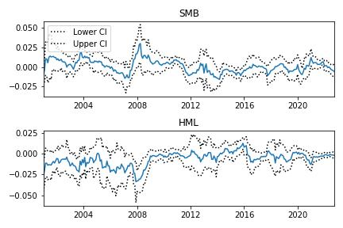

# The 3 steps to factor risk analysis

How to use a factor model to figure out a portfolio’s exposure to those factors.

Quants use factors to target specific drivers of returns and manage risk. Diversification is great until the entire market declines in value. That’s because the market influences all stocks. Factors can offset some of these risks by targeting drivers of return not influenced by the market.

Common factors are size (large-cap versus small-cap) and style (value versus growth). If you think small-cap stocks will outperform large-cap stocks, then you might want exposure to small-cap stocks. If you think value stocks will outperform growth stocks, then you might want exposure to value stocks. In either case, you want to measure the risk contribution of the factor.

### Use the Fama-French factor model to measure risk exposure

https://mba.tuck.dartmouth.edu/pages/faculty/ken.french/Data_Library/f-f_factors.html

Eugene Fama and Kenneth French built the Fama-French three-factor model in 1992. It’s a popular factor model you can use for free. The model includes size, style, and excess returns. You can read about the model on Kenneth French’s website. For this analysis, use the size and style factors.

---

Download the data for the Fama-French factors (SMB and HML) and the stock prices of four tech companies (SPY, MSFT, AAPL, and INTC). It then calculates the monthly returns of these stocks and computes the active returns of the portfolio relative to the benchmark (SPY).

Next, the code performs a linear regression of the active returns on the Fama-French factors (SMB and HML). The sensitivities of the active returns to these factors are obtained from the regression coefficients.

The code then plots the rolling sensitivities of the active returns to the Fama-French factors over time.

Finally, the code calculates the risk contributions of the Fama-French factors to the active returns of the portfolio

---

Key Takeaways:

- Download historic factor data

- Compute the sensitivities to the factors

- Figure out the risk contribution of the factors

---

import required libraries

- numpy 

- pandas

use pandas_datareader to download the factor data
- pandas_datareader

download stock price data
- yfinance 

modeling
- statsmodels

---

**File:** [Fama French](FamaFrench.ipynb)

---

## Step 1: Download historic factor data

    factors = pdr.get_data_famafrench(
        'F-F_Research_Data_Factors',
        start='2000-01-01'
    )[0][1:]

SMB is "small minus big" representing the size factor. 
HML is "high minus low" representing the style factor. 
This also downloads a third factor, Rm-Rf, which is the market excess return. 

Only use SMB and HML for this analysis.

Get the stock price data for portfolio. 

Pick any stocks you want. (Make sure to include a benchmark like SPY.)

    ['SPY', 'MSFT', 'AAPL', 'INTC']

The factor data is monthly so to align with the stock data, you need to get monthly closing prices and resample to monthly labels.

## Step 2: Compute the sensitivities to the factors

Compute the active return of the portfolio. The active return is the portfolio return minus the benchmark return.

- "Pop" the benchmark return off the returns data frame. 
- calculate the portfolio returns and subtract the benchmark.

Use regression to compute the sensitivities to the factors.

Put the active returns and factors into a DataFrame to make it easy to align the dates. 
Run a regression with the active returns as the dependent variable on the factors. 

Fitting the model gives you the two coefficients that determine the sensitivities of the portfolio’s active returns to the factors.

The sensitivities are estimates so it’s important to see how they evolve through time with their confidence intervals.

The sensitivities tell you how much the active portfolio returns change in response to changes in the factors. In other words, how the factors drive the active portfolio returns.

## Step 3: Figure out the risk contribution of the factors

Marginal Contribution To Active Risk (MCTAR) measures the incremental active risk each additional factor introduces to your portfolio.

To figure out the factors’ MCTAR, multiply the factor sensitivity by the covariance between the factors. 
divide by the standard deviation of the active returns, squared.

This tells you how much risk you take on by being exposed to each factor given the other factors you’re already exposed to. The unexplained risk contribution is the exposure you have to other factors outside of the two you analyzed.

Use this analysis to increase or decrease your exposure to these factors. 
Do this by under- or overweighting the stocks that represent these factors (e.g. large cap or value).

---

### Usage:

To use this code, you will need to specify the stocks and the benchmark index that you want to include in the portfolio. You can do this by modifying the list of ticker symbols in the yf.download() function. For example:

    data = yf.download(
        # include these stocks in the portfolio
        ['SPY', 'MSFT', 'AAPL', 'INTC'],  
        start="2000-01-01", 
        interval="1mo"
    )['Adj Close']
    
    
The benchmark index is assumed to be the first stock in the list (in this case, SPY).

The code then calculates the active returns of the portfolio and performs a linear regression 
of the active returns on the Fama-French factors (SMB and HML). The sensitivities of the active returns to these factors are obtained from the regression coefficients.

The code plots the rolling sensitivities of the active returns to the Fama-French factors over time, using a 12-month rolling window.
Finally, the code calculates the risk contributions of the Fama-French factors to the active returns of the portfolio